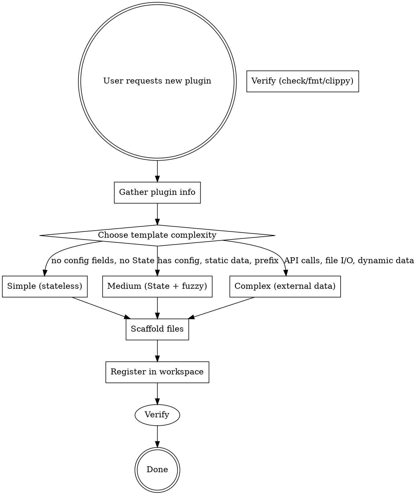

# Create Anyrun Plugin

## Overview

Scaffold a new anyrun plugin interactively. AI gathers plugin requirements from the developer, then generates all necessary files from templates and registers the plugin in the Cargo workspace.

## Prerequisites

- Working anyrun workspace (this repo)
- `plugins/plugin-sample/` exists (the official template)
- AGENTS.md consulted for conventions (no thiserror/anyhow, abi_stable FFI, RON config, etc.)

## Workflow



### Step 1: Gather plugin info

Ask the developer (one question at a time):

| Question       | Why                         | Example                                          |
| -------------- | --------------------------- | ------------------------------------------------ |
| Plugin name    | Crate name + directory name | `anyrun-github`                                  |
| Description    | Shown in PluginInfo         | "GitHub notifications & PRs"                     |
| Prefix         | Trigger string              | `gh `                                            |
| Icon           | GTK icon name               | `system-search`                                  |
| Config fields  | What user can configure     | `prefix`, `max_entries`, `api_token`             |
| State data     | What loads at init          | Static list, file read, shell command, API fetch |
| Handler action | What happens on selection   | Open URL, copy text, run command, Close          |

### Step 2: Choose template complexity

- **Simple (stateless):** Plugin has prefix, Config IS the State, no extra data. Like `anyrun-calc`.
- **Medium (State + fuzzy):** Has Config + separate State with static data, prefix-based, fuzzy matching. Like `plugin-sample`.
- **Complex (external data):** State loaded from files/API at init, complex matching logic. Like `anyrun-applications`.

### Step 3: Scaffold files

Create `<plugin-dir>/` (i.e. `plugins/<name>/`) with:

- `Cargo.toml`
- `src/lib.rs`
- `<name>.ron` (default config)
- `README.md`

### Step 4: Register in workspace

Add `"plugins/<name>",` to the `members` list in root `Cargo.toml`. Maintain alphabetical-ish ordering following existing convention.

### Step 5: Verify

```bash
cargo check -p <name>
cargo fmt --all --check
cargo clippy --workspace -- -D warnings
```

Fix any issues before declaring completion.

## Template: Simple (stateless)

For plugins where `Config` doubles as `State` and no extra data is needed.

**Cargo.toml:**

```toml
[package]
name = "<name>"
version = "0.1.0"
edition = "2024"

[lib]
crate-type = ["cdylib"]

[dependencies]
anyrun-plugin = { path = "../../anyrun-plugin" }
abi_stable    = "0.11.1"
ron           = "0.12.0"
serde         = { features = ["derive"], version = "1.0.228" }
```

**src/lib.rs:**

```rust
use abi_stable::std_types::{ROption, RString, RVec};
use anyrun_plugin::*;
use serde::Deserialize;
use std::fs;

#[derive(Deserialize)]
struct Config {
    prefix: String,
}

impl Default for Config {
    fn default() -> Self {
        Config { prefix: "<prefix>".into() }
    }
}

#[init]
fn init(config_dir: RString) -> Config {
    match fs::read_to_string(format!("{}/<name>.ron", config_dir)) {
        Ok(content) => ron::from_str(&content).unwrap_or_else(|e| {
            eprintln!("[<name>] config error: {}", e);
            Config::default()
        }),
        Err(_) => Config::default(),
    }
}

#[info]
fn info() -> PluginInfo {
    PluginInfo {
        name: "<Description>".into(),
        icon: "<icon>".into(),
    }
}

#[get_matches]
fn get_matches(input: RString, config: &Config) -> RVec<Match> {
    let mut matches = Vec::new();
    if input.starts_with(&config.prefix) {
        let query = &input[config.prefix.len()..];
        if !query.is_empty() {
            matches.push(Match {
                title: query.into(),
                description: ROption::RSome("do something".into()),
                use_pango: false,
                icon: ROption::RNone,
                id: ROption::RNone,
            });
        }
    }
    matches.into()
}

#[handler]
fn handler(selection: Match) -> HandleResult {
    HandleResult::Close
}
```

**<name>.ron:**

```ron
Config(
    prefix: "<prefix>",
)
```

## Template: Medium (State + fuzzy search)

For plugins with a Config struct, State with pre-loaded data, prefix-based activation, and fuzzy matching.

**Cargo.toml:**

```toml
[package]
name = "<name>"
version = "0.1.0"
edition = "2024"

[lib]
crate-type = ["cdylib"]

[dependencies]
anyrun-plugin = { path = "../../anyrun-plugin" }
anyrun-helper = { workspace = true }
abi_stable    = "0.11.1"
ron           = "0.12.0"
serde         = { features = ["derive"], version = "1.0.228" }
```

**src/lib.rs:**

```rust
use abi_stable::std_types::{ROption, RString, RVec};
use anyrun_plugin::*;
use anyrun_helper::icon::SystemIcon;
use serde::Deserialize;
use std::fs;

#[derive(Deserialize)]
struct Config {
    prefix: String,
    max_entries: usize,
    show_results_immediately: bool,
}

impl Default for Config {
    fn default() -> Self {
        Self {
            prefix: "<prefix>".into(),
            max_entries: 5,
            show_results_immediately: false,
        }
    }
}

pub struct State {
    config: Config,
    items: Vec<String>,
}

fn load_items() -> Vec<String> {
    vec![]
}

#[init]
fn init(config_dir: RString) -> State {
    let config_path = std::path::PathBuf::from(config_dir.to_string()).join("<name>.ron");
    let config: Config = fs::read_to_string(&config_path)
        .map_err(|e| format!("IO Error: {}", e))
        .and_then(|content| ron::from_str(&content).map_err(|e| format!("RON Error: {}", e)))
        .unwrap_or_else(|_err| Config::default());

    State {
        config,
        items: load_items(),
    }
}

#[info]
fn info() -> PluginInfo {
    PluginInfo {
        name: "<Description>".into(),
        icon: "<icon>".into(),
    }
}

#[get_matches]
fn get_matches(input: RString, state: &State) -> RVec<Match> {
    if !input.starts_with(&state.config.prefix) {
        return RVec::new();
    }

    let query = &input[state.config.prefix.len()..];

    if query.is_empty() && !state.config.show_results_immediately {
        return RVec::new();
    }

    let query_parts: Vec<&str> = query.split_whitespace().collect();

    state
        .items
        .iter()
        .filter(|item| {
            query.is_empty()
                || query_parts.iter().all(|part| {
                    anyrun_helper::mazzy_matcher::fuzzy_match(item, part).is_some()
                })
        })
        .take(state.config.max_entries)
        .map(|item| Match {
            title: item.to_owned().into(),
            description: ROption::RSome("Plugin".into()),
            use_pango: false,
            icon: ROption::RSome(SystemIcon::Folder.as_str().into()),
            id: ROption::RNone,
        })
        .collect::<Vec<_>>()
        .into()
}

#[handler]
fn handler(selection: Match) -> HandleResult {
    HandleResult::Close
}

#[cfg(test)]
mod tests {
    use super::*;

    #[test]
    fn test_config_parsing() {
        let content = r#"Config(prefix: "test ", max_entries: 3, show_results_immediately: false)"#;
        let config: Config = ron::from_str(content).expect("valid config");
        assert_eq!(config.prefix, "test ");
        assert_eq!(config.max_entries, 3);
    }
}
```

**<name>.ron:**

```ron
Config(
    prefix: "<prefix>",
    max_entries: 5,
    show_results_immediately: false,
)
```

## Template: Complex (external data)

For plugins that load dynamic data at init (files, APIs, shell commands), have complex matching, or need `#[handler]` with `&State`.

Use the Medium template as base, then:

1. Add data loading in `#[init]` before constructing State
2. Use richer matching (per-field scoring, keyword matching, etc.)
3. `#[handler]` borrows `&State` when action needs access to loaded data

Example pattern:

```rust
#[handler]
fn handler(selection: Match, state: &State) -> HandleResult {
    let id = selection.id.unwrap();
    if let Some(entry) = state.entry_map.get(&id) {
        // Execute action with entry data
    }
    HandleResult::Close
}
```

## Verification Checklist

After scaffolding, always run:

- [ ] `cargo check -p <name>` — compiles without errors
- [ ] `cargo fmt --all --check` — formatting correct
- [ ] `cargo clippy --workspace -- -D warnings` — no warnings
- [ ] Plugin appears in `cargo build --workspace` output
- [ ] Config file parses correctly with `ron::from_str`

## Common Mistakes

| Mistake                                       | Fix                                                                                      |
| --------------------------------------------- | ---------------------------------------------------------------------------------------- |
| Using `String`/`Vec`/`Option` at FFI boundary | Use `RString`/`RVec`/`ROption` and `.into()`                                             |
| Making plugin functions `pub`                 | Remove `pub` — proc-macros handle export                                                 |
| Adding `thiserror`/`anyhow`                   | Use `eprintln!` for errors, plain `Result` or `Option`                                   |
| Config file named wrong                       | Must be `<plugin_name>.ron` in config dir                                                |
| Forgetting `cdylib` crate type                | Add `crate-type = ["cdylib"]` to Cargo.toml                                              |
| `#[init]` mutable state                       | Use `static RwLock<Option<T>>` pattern (macro handles this)                              |
| Handler returns wrong HandleResult            | `Close` to close launcher, `Copy(Vec<u8>)` to copy to clipboard, `Continue` to stay open |
