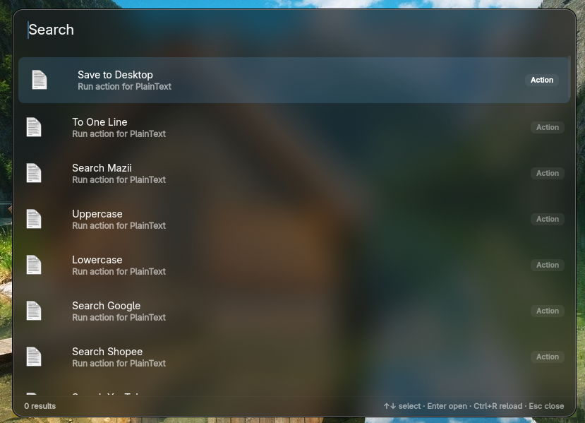

# Anyrun (Fork)

A Wayland-native application launcher (KRunner-like) with mouse scroll support, enhanced plugins, and broad compositor compatibility. Built with GTK4 + relm4 + gtk4-layer-shell.



> [!NOTE]
> If you use Nvidia and Anyrun refuses to close, set `GSK_RENDERER=ngl`. Run it as `GSK_RENDERER=ngl anyrun`. This is a [known issue](https://forums.developer.nvidia.com/t/580-65-06-gtk-4-apps-hang-when-attempting-to-exit-close/341308/6) dependent on driver versions.

## Features

### Fork Enhancements

- **Scroll when full**: When matches exceed the window height or `maxEntries`, scroll through the list with mouse or touchpad. Kinetic scrolling supported natively via GTK4.
- **Auto height**: Maximum height is set to half the screen height by default.
- **Enhanced Applications plugin**: Improved fuzzy search with Vietnamese accent stripping, custom system actions (shutdown, reboot, lock, suspend, logout), pre-process execution scripts, and desktop actions support.
- **24+ plugins**: Broad collection including Bluetooth control, browser tab switching, port killing, KDE settings, sync manager, clipboard history, and more.

### Standard Features

- **Style Customizability**: Full control via GTK4 CSS. Live editing with `GTK_DEBUG=interactive anyrun`.
- **Mouse Scroll Support**: Navigate results with mouse wheel or touchpad gestures.
- **Extensible Plugin System**: If it can handle input and selection, Anyrun can run it.
- **Easy Development**: Create custom plugins with just 4 functions using the `anyrun-plugin` crate.
- **Responsive**: Asynchronous plugin execution keeps the UI smooth.
- **Wayland Native**: Uses GTK4 layer shell for overlays and data-control for clipboard.
- **D-Bus IPC**: Single-instance daemon mode via D-Bus.

## Dependencies

Anyrun links statically against these libraries. Install the development packages for your distribution:

- `gtk4-layer-shell` (libgtk4-layer-shell)
- `gtk4` (libgtk-4 libgdk-4)
- `pango` (libpango-1.0)
- `cairo` (libcairo libcairo-gobject)
- `gdk-pixbuf2` (libgdk_pixbuf-2.0)
- `glib2` (libgobject-2.0 libgio-2.0 libglib-2.0)

> **Important**: Since 25.12.0, Anyrun also requires `anyrun-provider` as a companion binary (search backend). Set its path via the `provider` config option if not in `$PATH`.

## Installation

### From Source

```bash
# Clone and enter
git clone https://github.com/mintori09/anyrun-fork && cd anyrun-fork

# Build the workspace
cargo build --release

# Create config directory
mkdir -p ~/.config/anyrun/plugins

# Copy plugins and binaries
cp target/release/*.so ~/.config/anyrun/plugins
sudo cp target/release/anyrun /usr/bin/anyrun
sudo cp target/release/anyrun-provider /usr/bin/anyrun-provider

# Copy default config and style
cp examples/config.ron ~/.config/anyrun/config.ron
cp examples/style.css ~/.config/anyrun/style.css
```

### Nix / Home-Manager

See [nix/modules/home-manager.nix](nix/modules/home-manager.nix) for the Home-Manager module. Build individual packages with `nix build` in `nix/packages/`.

Use the binary cache to avoid rebuilding:
```nix
nix.settings = {
  builders-use-substitutes = true;
  extra-substituters = [ "https://anyrun.cachix.org" ];
  extra-trusted-public-keys = [
    "anyrun.cachix.org-1:pqBobmOjI7nKlsUMV25u9QHa9btJK65/C8vnO3p346s="
  ];
};
```

### Arch Linux

A `PKGBUILD` is included in the repository root.

## Usage

```bash
# Start the daemon (single instance via D-Bus)
anyrun daemon &

# Launch the runner
anyrun

# Diagnose config, provider, and plugins
anyrun doctor
```

### Arguments

| Argument | Short | Description |
|----------|-------|-------------|
| `--config-dir` | `-c` | Override the config directory (default: `~/.config/anyrun`) |
| `--plugins` | | Override loaded plugins (repeatable) |
| `--position` | | Override window position (e.g. `top`, `center`) |
| `daemon` | | Start in daemon mode (D-Bus single-instance) |
| `doctor` | | Check config, provider path, and plugin loadability |

Any config field can be overridden via CLI. Example:
```bash
anyrun --plugins libapplications.so --plugins libsymbols.so --position top
```

## Configuration

Config directory layout:
```
~/.config/anyrun/
├── config.ron          # Main configuration
├── style.css           # GTK4 CSS styling
├── plugins/            # Plugin shared libraries (.so)
│   ├── libapplications.so
│   ├── libsymbols.so
│   └── ...
├── applications.ron    # Plugin-specific config
├── symbols.ron
└── ...
```

### Main Config (`config.ron`)

See [examples/config.ron](examples/config.ron) for the full annotated default.

Key options:
- `x`, `y`, `width`, `height`: Position/size as `Fraction(n)` or `Absolute(n)`
- `hide_icons`: Hide plugin and match icons
- `ignore_exclusive_zones`: Ignore layer-shell exclusive zones (e.g. Waybar)
- `layer`: Window layer — `Background`, `Bottom`, `Top`, or `Overlay`
- `hide_plugin_info`: Hide the plugin info panel
- `close_on_click`: Close on outside click
- `show_results_immediately`: Show results on open
- `max_entries`: Global result limit (None = unlimited)
- `plugins`: Ordered list of plugin `.so` files (order = priority)
- `provider`: Path to `anyrun-provider` binary
- `keybinds`: Custom key binding actions (Select, OpenActions, Up, Down, Close)
- `search_ux`: Search UX tuning (settle/flush delays, plugin timeout/health, prefix discovery, empty recent state)

### Styling

Anyrun supports [GTK4 CSS](https://docs.gtk.org/gtk4/css-properties.html). Style classes:

| Class | Widget | Description |
|-------|--------|-------------|
| (none) | `GtkEntry` | Main entry box |
| (none) | `GtkWindow` | Main window |
| `.main` | `GtkBox` | Container box |
| `.matches` | `GtkBox` | Results container |
| `.plugin` | `GtkBox` | Plugin info box |
| `.plugin .info` | `GtkBox`/`GtkImage`/`GtkLabel` | Plugin metadata |
| `.match` | `GtkBox` | Match entry row |
| `.match .title` | `GtkLabel` | Match title |
| `.match .description` | `GtkLabel` | Match description |

Use `GTK_DEBUG=interactive anyrun` for live CSS editing. See [anyrun/res/style.css](anyrun/res/style.css) for the default style.

## Plugins

### Quick Reference

| Plugin | File | Prefix | Description |
|--------|------|--------|-------------|
| [Applications](plugins/anyrun-applications) | `libapplications.so` | (none) | Desktop entry search and launch |
| [Calc](plugins/anyrun-calc) | `libcalc.so` | `=` | Calculator via qalc |
| [Find Files](plugins/anyrun-findfiles) | `libfindfiles.so` | `fd ` | File search via fd |
| [Shell Wrapper](plugins/anyrun-shell-wrapper) | `libshell_wrapper.so` | configurable | Execute shell commands from list sources |
| [Shell Wrapper Once](plugins/anyrun-shell-wrapper-once) | `libshell_wrapper_once.so` | configurable | Execute commands with user input |
| [Universal Action](plugins/anyrun-universal-action) | `libuniversal_action.so` | `:ua ` | Context-aware actions on clipboard content |
| [Web Search](plugins/anyrun-websearch) | `libwebsearch.so` | configurable | Multi-engine web search |
| [Zoxide](plugins/anyrun-zoxide) | `libzoxide.so` | `z ` | Fuzzy directory jumping via zoxide |
| [KDE Settings](plugins/anyrun-kde-setting) | `libkde_setting.so` | `s ` | KDE System Settings browser |
| [Browser Tabs](plugins/anyrun-browser) | `libbrowser.so` | `tab ` | Search and switch browser tabs via brotab |
| [Sync Manager](plugins/anyrun-sync-manager) | `libsync_manager.so` | `sy ` | Run custom sync scripts |
| [Bluetooth](plugins/anyrun-bluetooth) | `libbluetooth.so` | `bt ` | Control Bluetooth adapters and devices |
| [KDE Clipboard](plugins/kde-clipboard) | `libkde_clipboard.so` | `hf ` | Search Klipper clipboard history |
| [Port Killer](plugins/kill-port) | `libkill_port.so` | `port ` | Kill processes listening on ports |
| [Window Switcher](plugins/window-switcher) | `libwindow_switcher.so` | configurable | Focus windows across workspaces |
| [Symbols](plugins/symbols) | `libsymbols.so` | `icon` | Unicode symbol lookup |
| [Translate](plugins/translate) | `libtranslate.so` | `:` | Google Translate integration |
| [Kidex](plugins/kidex) | `libkidex.so` | (none) | File search via Kidex index |
| [Randr](plugins/randr) | `librandr.so` | `:dp` | Monitor configuration (Hyprland) |
| [Stdin](plugins/stdin) | `libstdin.so` | (none) | dmenu-like fuzzy selector |
| [Dictionary](plugins/dictionary) | `libdictionary.so` | `:def` | Word definitions via Free Dictionary API |
| [Nix-run](plugins/nix-run) | `libnix_run.so` | `:nr ` | Run nixpkgs apps via `nix run` |
| [Sample](plugins/plugin-sample) | — | `ex ` | Plugin development template |

### Plugin Development

Create a new plugin with just 4 functions. See `plugins/plugin-sample/` for a template.

**Cargo.toml:**
```toml
[lib]
crate-type = ["cdylib"]

[dependencies]
anyrun-plugin = { path = "<path-to>/anyrun-plugin" }
abi_stable = "0.11.1"
```

**lib.rs:**
```rust
use abi_stable::std_types::{RString, RVec, ROption};
use anyrun_plugin::*;

#[init]
fn init(config_dir: RString) -> State {
    // Load config, initialize state
    State { /* ... */ }
}

#[info]
fn info() -> PluginInfo {
    PluginInfo {
        name: "My Plugin".into(),
        icon: "help-about".into(),
    }
}

#[get_matches]
fn get_matches(input: RString, state: &State) -> RVec<Match> {
    // Return matches based on input
    vec![].into()
}

#[handler]
fn handler(selection: Match, state: &State) -> HandleResult {
    HandleResult::Close
}
```

The `#[init]` function runs in a separate thread and returns shared state. `#[get_matches]` uses fuzzy matching via `anyrun_helper::mazzy_matcher`. State is wrapped in `RwLock<Option<T>>` internally.

### HandleResult

| Variant | Description |
|---------|-------------|
| `HandleResult::Close` | Close Anyrun after handling |
| `HandleResult::Copy(Vec<u8>)` | Copy data to clipboard and close |
| `HandleResult::Stdout(Vec<u8>)` | Print to stdout and close |
| `HandleResult::Refresh(bool)` | Refresh results (true = keep open, false = close) |
| `HandleResult::Continue` | Keep Anyrun open |

## Architecture

### Cargo Workspace

```
├── anyrun/                      # GTK4 UI binary
├── anyrun-plugin/               # Plugin SDK crate
├── anyrun-macros/               # Proc-macro crate (init, info, get_matches, handler)
├── anyrun-helper/               # Shared utilities (icons, logger, fuzzy matcher, clipboard)
├── anyrun-provider/             # Search provider binary (separate process)
│   └── anyrun-provider-ipc/     # Shared IPC request/response types
└── plugins/                     # Plugin crates (cdylib)
    ├── anyrun-applications/
    ├── anyrun-calc/
    └── ...
```

### Request Lifecycle

1. User types in the GTK4 entry box
2. Input is debounced (settle delay), then sent to `anyrun-provider` via Unix socket
3. Provider dispatches queries to loaded plugin libraries
4. Plugins return `RVec<Match>` results via `abi_stable` FFI
5. Results are ranked and rendered in the GTK4 list
6. On selection, the plugin's `#[handler]` executes the action

### IPC Protocol

`anyrun-provider` communicates via Unix domain socket using types from `anyrun-provider-ipc`:
- `Request::Query { text, phase, plugins }`
- `QueryPhase::Settling` (debounced final query)
- `QueryPhase::Flushing` (batched incremental results)

## Troubleshooting

| Problem | Solution |
|---------|----------|
| Anyrun hangs on close (Nvidia) | `GSK_RENDERER=ngl anyrun` |
| Plugins not loading | Check `~/.config/anyrun/plugins/` exists and contains `.so` files |
| Provider not found | Install `anyrun-provider` or set path in config |
| No results from plugin | Check plugin-specific dependencies (qalc, fd, zoxide, etc.) |
| Wrong screen position | Adjust `x`/`y` in `config.ron` |
| GTK CSS not applying | Use `GTK_DEBUG=interactive anyrun` to inspect widgets |

## License

This project is licensed under the terms of the [LICENSE](LICENSE) file in the repository root.
