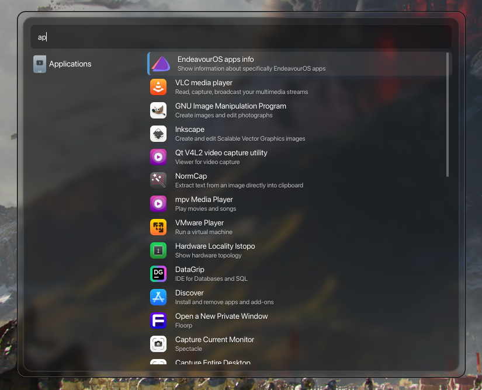

Here is the updated README for your Anyrun fork, written in English. It preserves the original author's documentation while integrating your custom plugins and the new mouse scroll feature.

---

# Anyrun (Fork)

A Wayland-native runner, similar to KRunner, built with extreme customizability in mind. This fork includes additional plugins and features such as mouse scroll support.



> [!NOTE]
> If you use Nvidia and Anyrun refuses to close, you need to set `GSK_RENDERER=ngl`.
> Run it as: `GSK_RENDERER=ngl anyrun`. This is a [known issue](https://forums.developer.nvidia.com/t/580-65-06-gtk-4-apps-hang-when-attempting-to-exit-close/341308/6) dependent on driver versions.

---

## Features

- **Style Customizability:** Full control via GTK4 CSS.
- **Mouse Scroll Support:** Navigate through result entries using the mouse wheel.
- **Extensible Plugin System:** If it can handle input and selection, Anyrun can run it.
- **Easy Development:** Create custom plugins with just 4 functions using the `anyrun-plugin` crate.
- **Responsive:** Asynchronous execution of plugin functions ensures the UI never hangs.
- **Wayland Native:** Uses GTK4 layer shell for overlays and data-control for clipboard management.

---

## Installation

### Dependencies

Anyrun depends on GTK4 libraries and Rust for building.

- `gtk4-layer-shell`
- `gtk4` (libgtk-4, libgdk-4)
- `pango`
- `cairo`
- `gdk-pixbuf2`
- `glib2`
- **anyrun-provider**: Since version 25.12.0, this is required to provide search results.

### Manual Installation

1. Clone this fork:

```bash
git clone https://github.com/your-username/anyrun && cd anyrun

```

2. Build and install:

```bash
cargo build --release
cargo install --path anyrun/

```

3. Setup configuration:

```bash
mkdir -p ~/.config/anyrun/plugins
cp target/release/*.so ~/.config/anyrun/plugins
cp examples/config.ron ~/.config/anyrun/config.ron

```

### Nix

If using Nix, you can add this repository as a flake input. Refer to the original Nix configuration instructions in the [Nix section](https://www.google.com/search?q=%23nix-configuration-details) below.

---

## Plugins

This fork includes several specialized plugins to enhance your workflow. Add the `.so` files to your `config.ron` to enable them.

### New & Enhanced Plugins

- **Applications (`libanyrun_applications.so`)**: Enhanced search and execution for desktop entries.
- **Calc (`libanyrun_calc.so`)**: A fast, lightweight calculator for mathematical expressions.
- **Findfiles (`libanyrun_findfiles.so`)**: Efficient file searching within your home directory or specified paths.
- **Shell Wrapper (`libanyrun_shell_wrapper.so`)**: An improved wrapper for executing shell commands with better feedback.
- **Universal Action (`libanyrun_universal_action.so`)**: Context-aware actions for various types of input and files.
- **Websearch (`libanyrun_websearch.so`)**: Search the web using engines like Google, DuckDuckGo, and Bing.
- **Zoxide (`libanyrun_zoxide.so`)**: Quick directory jumping powered by [Zoxide](https://github.com/ajeetdsouza/zoxide).

### Standard Plugins

- **Symbols**: Search and copy Unicode symbols.
- **Rink**: Advanced calculator and unit conversion.
- **Translate**: Quick text translation.
- **Kidex**: File indexing search.
- **Randr**: Monitor configuration (Rotation/Resize) — currently supports Hyprland.
- **Dictionary**: Look up word definitions.
- **Niri-focus**: Focus windows in the Niri compositor.

---

## Configuration

The config directory is located at `~/.config/anyrun`.

```text
- anyrun/
  - plugins/ (Dynamic libraries .so)
  - config.ron (Main settings)
  - style.css (GTK CSS)
  - <plugin-name>.ron (Plugin specific settings)

```

### Styling

You can style Anyrun using standard GTK4 CSS. Key classes include:

- `.main`: The outer container.
- `.matches`: The container for result entries.
- `.match`: Individual result items.
- `.title` & `.description`: Text elements within a match.

**Pro tip:** Run `GTK_DEBUG=interactive anyrun` to tweak your CSS live.

---

## Plugin Development

Anyrun plugins are dynamic libraries (`cdylib`) written in Rust.

**Minimal `lib.rs` structure:**

```rust
use abi_stable::std_types::{RString, RVec, ROption};
use anyrun_plugin::*;

#[init]
fn init(config_dir: RString) {}

#[info]
fn info() -> PluginInfo {
    PluginInfo {
        name: "My Plugin".into(),
        icon: "edit-find".into(),
    }
}

#[get_matches]
fn get_matches(input: RString) -> RVec<Match> {
    vec![Match {
        title: "Example".into(),
        ..Default::default()
    }].into()
}

#[handler]
fn handler(selection: Match) -> HandleResult {
    HandleResult::Close
}

```

---

<a name="nix-configuration-details"></a>

## Nix Configuration (Advanced)

To use the Home-Manager module with your flake:

```nix
{
  inputs.anyrun.url = "github:your-username/anyrun";

  outputs = { self, nixpkgs, anyrun, ... }: {
    homeConfigurations."user" = home-manager.lib.homeManagerConfiguration {
      modules = [
        anyrun.homeManagerModules.default
        {
          programs.anyrun = {
            enable = true;
            config = {
              x.fraction = 0.5;
              y.fraction = 0.3;
              plugins = [
                "${anyrun.packages.${pkgs.system}.anyrun-applications}/lib/libapplications.so"
              ];
            };
          };
        }
      ];
    };
  };
}

```

---

**Next Step:** Would you like me to help you generate a specific `style.css` template or a sample `config.ron` for your new plugins?
